# 🍽️ Canteen Sales and Inventory Management System

A web-based Canteen Sales and Inventory Management System built using **Streamlit**, **Python**, **MySQL**, and **Pandas**. The application helps manage daily canteen operations by recording sales transactions, tracking inventory levels, uploading bulk data, and generating interactive dashboards and business reports.

The system combines **transaction management** with **data analytics**, enabling users to monitor sales performance, identify top-selling products, track stock availability, and make data-driven decisions through visual reports.

## ✨ Features

- 🔐 Secure user authentication with role-based login.
- 📊 Interactive dashboard displaying key sales and inventory metrics.
- 💰 Record and manage daily sales transactions.
- 📦 Track inventory, stock usage, and remaining stock.
- 📁 Bulk upload sales and inventory data using CSV or Excel files.
- 📈 Sales analysis with interactive charts and business insights.
- 📉 Inventory analysis for stock monitoring and replenishment.
- 📋 Business intelligence reports for decision-making.
- 🗂️ Sales and inventory data management (view, update, and delete records).
- 🛢️ MySQL database integration for persistent data storage.

## 📸 Application Screenshots

### 🔐 Login Page

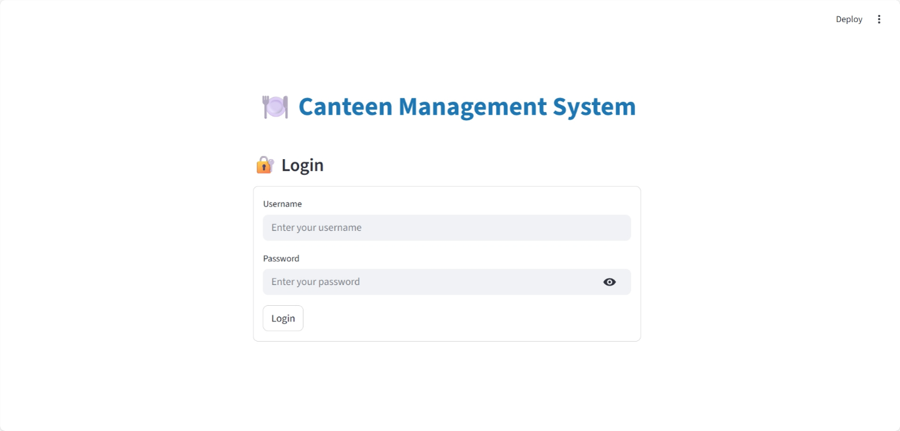

---

### 📊 Dashboard Overview


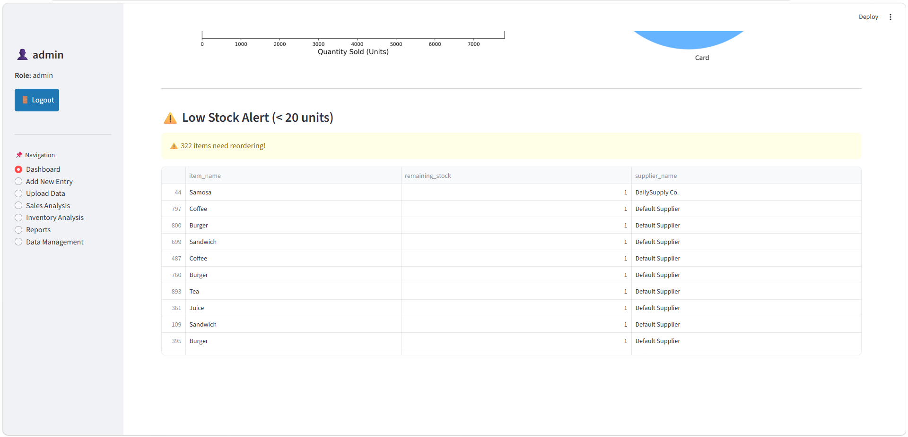

---

### ➕ Add New Entry

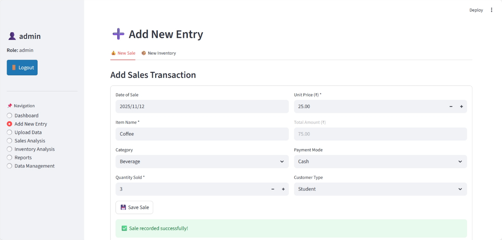

---

### 📁 Bulk Upload

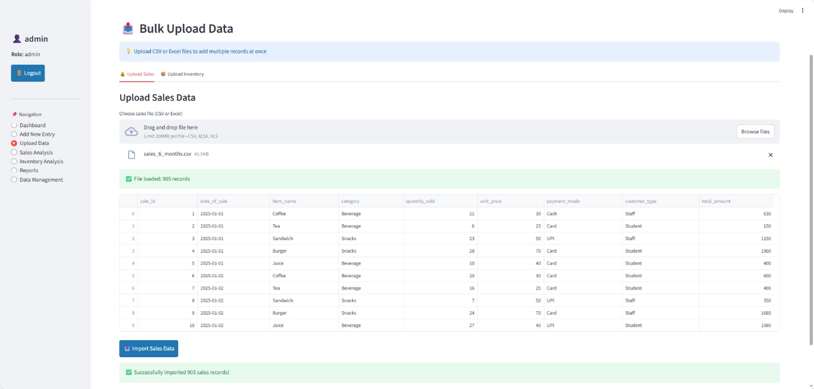

---

### 📈 Sales Analysis

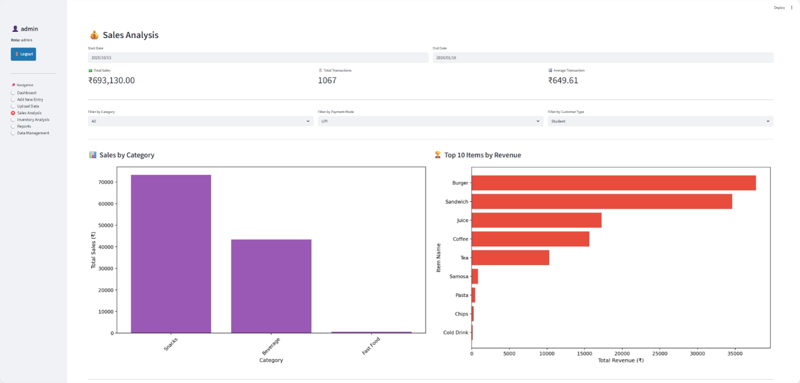
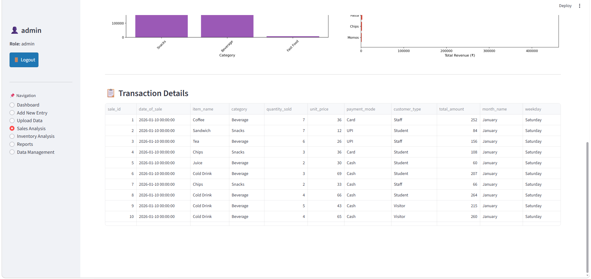

---

### 📦 Inventory Analysis


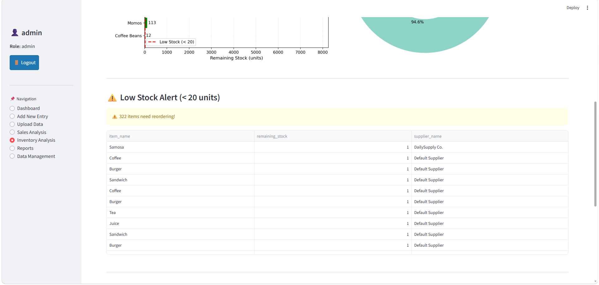
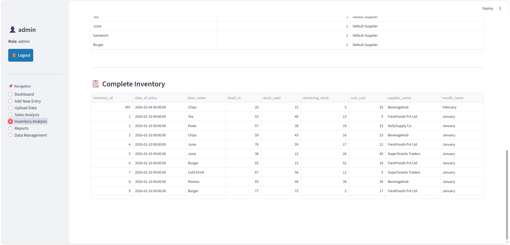
---

### 📋 Business Intelligence Reports

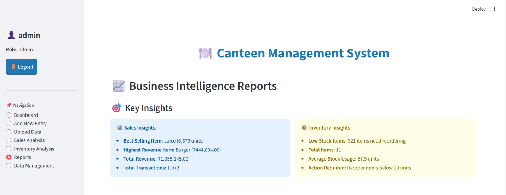
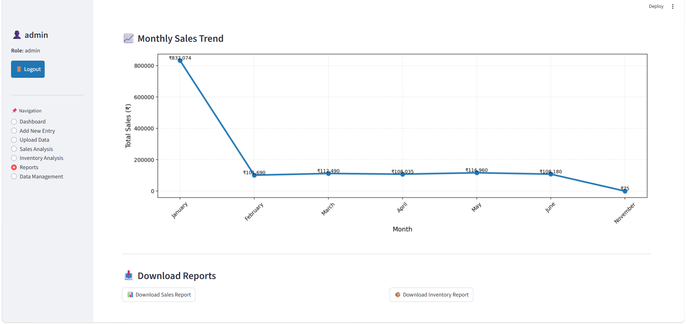

---

### 🗂️ Data Management

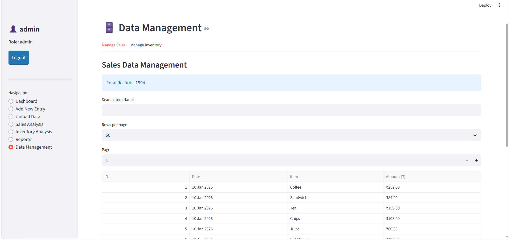


## 🎯 Quick Start

### Prerequisites
- Python 3.8+
- MySQL Server
- Git

### Setup (5 minutes)

```bash
# 1. Clone & navigate
git clone https://github.com/Navdeep32/canteen-management-system.git
cd canteen-management-system

# 2. Create virtual environment
python -m venv venv
source venv/bin/activate  # or: venv\Scripts\activate (Windows)

# 3. Install dependencies
pip install -r requirements.txt

# 4. Create database
mysql -u root -p
CREATE DATABASE canteen;
EXIT;

# 5. Create .streamlit/secrets.toml
mkdir .streamlit
# Create file with:
# DB_HOST = "localhost"
# DB_USER = "root"
# DB_PASSWORD = "your_password"
# DB_NAME = "canteen"

# 6. Test connection
python scripts/database/test_connection.py

# 7. Run app
streamlit run src/app.py
```

App opens at: `http://localhost:8501`

## 📂 Dataset

The project uses sales and inventory data stored in a **MySQL database**. Jupyter notebooks are used for data import and preprocessing before the data is used by the Streamlit application.

## 📚 Documentation

- **[QUICK_START.md](QUICK_START.md)** - Detailed setup guide
- **[docs/SCRIPTS.md](docs/SCRIPTS.md)** - Available utility scripts
- **[docs/ARCHITECTURE.md](docs/ARCHITECTURE.md)** - System design
- **[docs/DATABASE_SCHEMA.md](docs/DATABASE_SCHEMA.md)** - Database structure
- **[docs/USER_GUIDE.md](docs/USER_GUIDE.md)** - How to use
- **[docs/TROUBLESHOOTING.md](docs/TROUBLESHOOTING.md)** - Common issues

## 🛠️ Tech Stack

- Frontend: Streamlit
- Backend: Python
- Database: MySQL
- Data Processing: Pandas, NumPy
- Visualization: Matplotlib

## 🔐 Security

- Passwords hashed with SHA-256
- Sensitive configuration managed through Streamlit secrets
- Input validation on forms

## License

This project was developed for academic and portfolio purposes.
