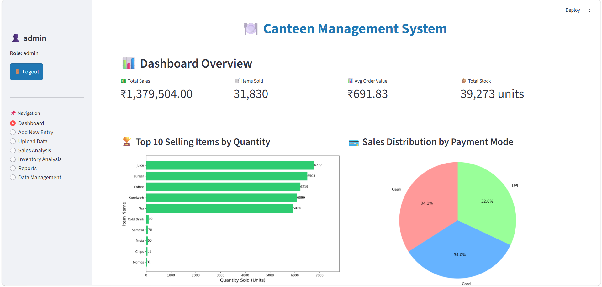
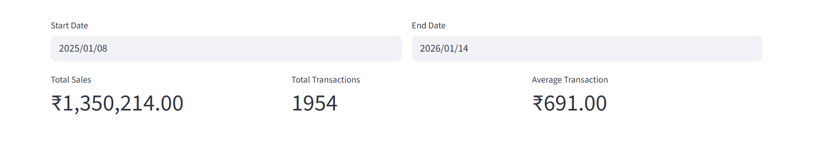
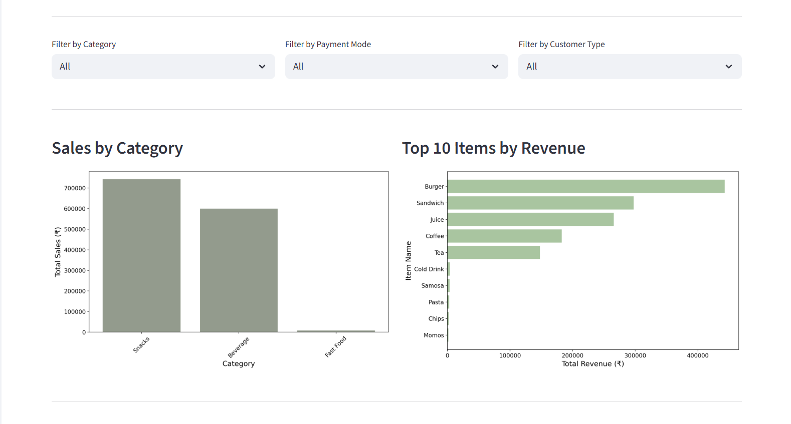
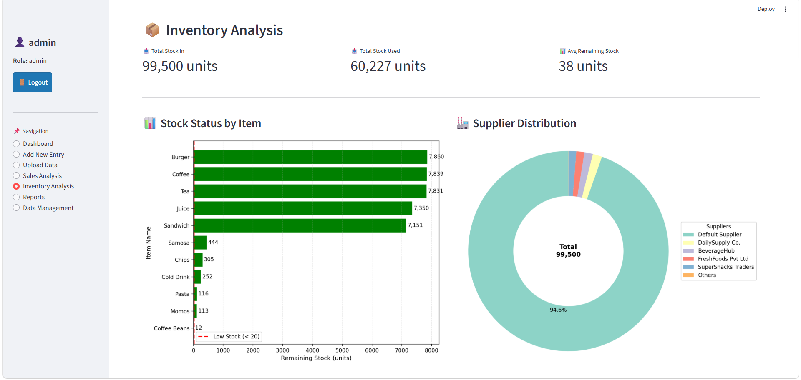
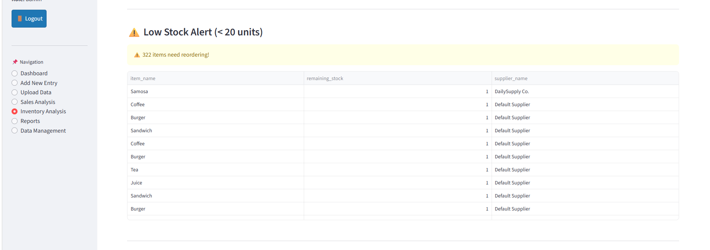
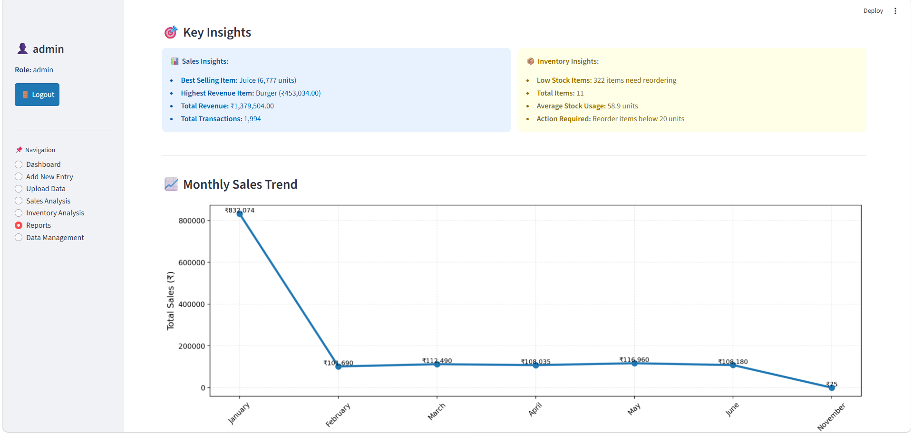

# Canteen Sales & Inventory Analytics 

A data analytics-focused web application for analyzing canteen sales and inventory data, monitoring business performance, identifying trends, and supporting inventory decisions.

Built using `Python`, `Pandas`, `MySQL`, `Streamlit`, and `Matplotlib`.

## Project Overview

The project analyzes simulated canteen sales and inventory data stored in a MySQL database.

The analysis focuses on:

* Sales performance and trends
* Revenue and transaction KPIs
* Product-level sales performance
* Inventory levels and stock usage
* Low-stock identification
* Business insights from sales and inventory data

Python and Pandas are used for data processing and analysis, while MySQL is used for data storage and querying. Streamlit is used to present the analysis through an interactive dashboard.

## Key Analysis

### Sales Analysis

* Track sales and revenue KPIs
* Analyze sales trends over time
* Identify top-performing products
* Examine transaction and product-level performance
* Generate business insights from sales data

### Inventory Analysis

* Monitor current stock levels
* Analyze stock usage
* Identify low-stock items
* Compare inventory availability across products
* Support inventory monitoring and replenishment decisions

### Data Management

* Upload sales and inventory data from CSV or Excel files
* Store structured data in MySQL
* Process and analyze data using Pandas

## Dashboard Screenshots

### Dashboard Overview



---

### Sales Analysis




---

### Inventory Analysis




---

### Key Business Insights



## Quick Start

### Prerequisites
- Python 3.8+
- MySQL Server
- Git

### Setup 

```bash
# 1. Clone & navigate
git clone https://github.com/Navdeep32/canteen-management-system.git
cd canteen-management-system

# 2. Create virtual environment
python -m venv venv
source venv/bin/activate  # or: venv\Scripts\activate (Windows)

# 3. Install dependencies
pip install -r requirements.txt

# 4. Create database
mysql -u root -p
CREATE DATABASE canteen;
EXIT;

# 5. Create .streamlit/secrets.toml
mkdir .streamlit

# 6. Test connection
python scripts/database/test_connection.py

# 7. Run app
streamlit run src/app.py
```

App opens at: `http://localhost:8501`

## Dataset

The project uses simulated canteen sales and inventory data stored in a **MySQL database**.

## Tech Stack

* Python – Data analysis and processing
* Pandas – Data manipulation and analysis
* MySQL – Data storage and SQL queries
* Matplotlib – Data visualization
* Streamlit – Interactive dashboard